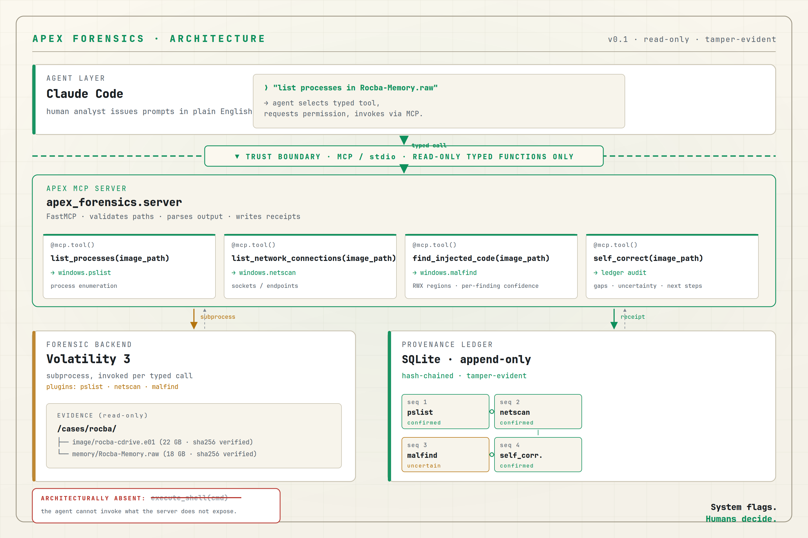

# APEX Forensics

**An AI forensic-triage agent that physically cannot spoliate evidence — and that proves it with a tamper-evident provenance ledger.**

APEX Forensics wraps Volatility 3 behind a small read-only MCP (Model Context Protocol) server. An AI agent (Claude Code) connects to the server and can call only four typed functions — no shell, no file writes, no operations outside `/cases/`. Every tool invocation produces a hash-chained SQLite receipt, so the entire chain of custody can be re-verified in three seconds.

Built for the SANS Build the Forensic Future Hackathon, June 2026.



---

## The three-second integrity proof

A judge can verify the entire audit trail of any APEX session with one command:

```bash
python3 -c "from apex_forensics import ledger; \
  ledger.open_ledger('/cases/apex_ledger/ledger.db'); \
  ok, broken_at = ledger.verify(); \
  print(f'chain ok: {ok}, broken at: {broken_at}')"
```

Output on a valid session:

```
chain ok: True, broken at: None
```

If a single byte in any prior receipt has been altered, this command returns the sequence number where the chain broke. The receipts are SHA-256 hash-chained; tampering is mathematically detectable, not policy-enforced.

---

## What makes this different

Protocol SIFT (the SANS-provided baseline) is an unconstrained agent driving forensic CLIs. It works, but the SANS team itself notes it is **"not validated for forensic soundness or evidentiary reliability."** APEX Forensics is built to close that gap with three architectural decisions:

1. **Read-only enforcement is architectural, not prompted.** The MCP server exposes four typed functions and no general shell. The agent cannot ask for `execute_shell()` — the function does not exist. Spoliation guard: any path outside `/cases/` raises `ValueError` at the function boundary, not at the agent's discretion.

2. **Every finding is receipted.** Each tool invocation writes one row to a SQLite ledger: input args, SHA-256 of the raw output, parsed structured finding, confidence tag, and the previous receipt's hash. Receipts form a hash chain. A judge does not have to trust the agent's claims; they re-hash the ledger.

3. **Confidence is per-finding, not per-tool.** When `find_injected_code` reports a region of executable private memory, that region carries its own `confirmed | inferred | uncertain` tag based on the owning process. JIT-noisy processes (MsMpEng, Teams, Electron apps) are auto-downgraded to `uncertain`. No malfind hit is automatically `confirmed` — confirmation requires correlation with disk artifacts and human review.

---

## The four tools

| Function | Wraps | What it returns |
|---|---|---|
| `list_processes(image_path)` | `windows.pslist` | Structured process list + receipt |
| `list_network_connections(image_path)` | `windows.netscan` | Endpoints, ESTABLISHED/LISTENING counts + receipt |
| `find_injected_code(image_path)` | `windows.malfind` | RWX regions with per-region confidence + receipt |
| `self_correct(image_path)` | ledger audit | Uncertainty summary, coverage gaps, recommended next steps + receipt |

`self_correct` is the Wold-Method self-correction discipline as code: the agent reviews its own ledger, surfaces uncertainty across prior receipts, identifies coverage gaps based on a transparent rule table (e.g., "RDP port-3389 activity was observed but `windows.sessions` was not run"), and writes the audit itself as a receipt. Meta-reasoning becomes part of the chain of custody.

---

## Try it

### Prerequisites

- Linux (tested on Ubuntu 24 / SIFT Workstation)
- Python 3.10+
- [Volatility 3](https://github.com/volatilityfoundation/volatility3) installed and on PATH as `vol`
- A memory image to analyze, placed under `/cases/`

### Install

```bash
git clone https://github.com/Vector-Research-Labs-LLC/apex-forensics.git
cd apex-forensics
pip install --break-system-packages -e .
```

### Run the smoke tests

```bash
python3 tests/test_ledger_smoke.py        # ledger chain + tamper detection
python3 tests/test_server_smoke.py        # list_processes against a real image
python3 tests/test_netscan_smoke.py       # list_network_connections
python3 tests/test_malfind_smoke.py       # find_injected_code + confidence classifier
python3 tests/test_self_correct.py        # full sequence + self-correction
```

Each test prints structured output, writes receipts to `/cases/apex_ledger/ledger.db`, and runs `ledger.verify()` at the end.

### Wire to Claude Code

The repo includes a `.mcp.json`. Launch Claude Code from the repo root:

```bash
cd apex-forensics
claude
```

Claude Code auto-discovers the server. Verify with `/mcp` — you should see `apex-forensics · ✓ connected · 4 tools`. Then prompt the agent:

> *"List the processes in `/cases/rocba/memory/Rocba-Memory.raw` and report the receipt hash."*

The agent will request permission to invoke `list_processes`, call your typed function, write a receipt, and report the result with its receipt sequence number and hash.

### Verify the ledger after the session

```bash
sqlite3 /cases/apex_ledger/ledger.db \
  "SELECT seq, tool, confidence, substr(this_hash,1,20) FROM receipts ORDER BY seq;" \
  -header -column
```

```
seq  tool                          confidence  substr(this_hash,1,20)
---  ----------------------------  ----------  --------------------
1    windows.pslist                confirmed   3d11e34ee92da37be3a6
2    windows.netscan               confirmed   3ef5b9c09e994df39dba
3    windows.malfind               uncertain   befb5fd3bfbae2d51a66
4    apex.self_correct             confirmed   <hash>
```

Then run the three-second integrity proof above to confirm the chain is intact.

---

## How it was built

This is a single-author submission. The build log lives at [`docs/BUILD-LOG.md`](docs/BUILD-LOG.md) — every decision, every failure mode, every milestone with timestamps.

Core architecture is ~600 lines of Python across two files:

- `apex_forensics/ledger.py` (~145 lines) — hash-chained SQLite ledger, stdlib only (sqlite3 + hashlib + json)
- `apex_forensics/server.py` (~480 lines) — FastMCP server, four typed tools, JIT-process classifier, self-correction rule table

No external dependencies beyond the MCP SDK and Volatility 3.

---

## Honest limitations

This is a hackathon submission, not production software. Known limitations:

- **Text-based Vol3 output parsing** in `find_injected_code` over-counts regions when hex-dump lines follow real findings (e.g., reports phantom "PID 48 named '89'" rows from hex bytes misread as data). Real findings are catchable in the receipt's raw output; fix path is `--renderer=json` for structured parsing. Documented to demonstrate the audit-trail value: every phantom finding can be traced back to its source.
- **Four tools is a deliberately small surface.** Breadth is not the design goal; receipted reasoning over a small, well-typed surface is. `windows.sessions`, `windows.pstree`, `windows.dlllist` are explicit coverage gaps surfaced by `self_correct`.
- **No disk-image analysis yet** — memory only. The architecture extends cleanly to disk plugins; the work to add them is mechanical.

---

## License

MIT. See [`LICENSE`](LICENSE).

## Author

Jason Wold · Vector Research Labs · jason.wold@vectorresearchlabs.com
